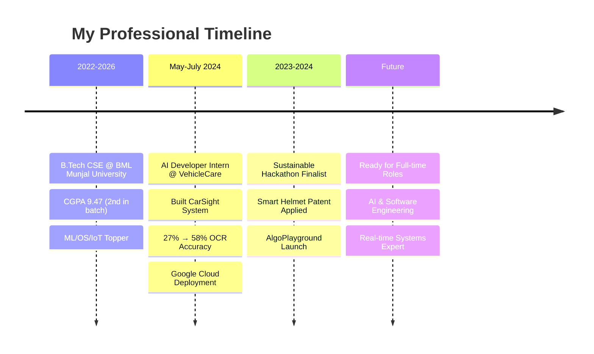

# 👋 Hi there, I'm Nihar Singla!

<div align="center">
  
[](https://git.io/typing-svg)

</div>

---

## 🚀 About Me


I'm an **Entry-Level AI & Software Engineer** and **Full-Stack Developer** specialized in **Real-Time Systems** and **Visual Learning Platforms**. Currently pursuing B.Tech in CSE at BML Munjal University with a CGPA of 9.47 (2nd in batch).

🎯 **What I'm passionate about:**
- 🤖 Building scalable AI solutions
- 🎮 Creating interactive learning tools
- 🔧 Developing IoT systems that solve real problems
- 📊 Optimizing algorithms for better performance

---

## 🛠️ Tech Arsenal

<details>
<summary>💻 Programming Languages</summary>
<br>

```text
Python    ████████████████████░   95%
Java      ████████████████░░░░░   80%
C++       ███████████████░░░░░░   75%
JavaScript████████████████░░░░░   85%
SQL       ██████████████░░░░░░░   70%
```

</details>

<details>
<summary>🚀 Frameworks & Libraries</summary>
<br>

<table>
<tr>
<td align="center" width="96">

<br>FastAPI
</td>
<td align="center" width="96">

<br>React
</td>
<td align="center" width="96">

<br>Next.js
</td>
<td align="center" width="96">

<br>Node.js
</td>
<td align="center" width="96">

<br>Spring Boot
</td>
</tr>
<tr>
<td align="center" width="96">

<br>OpenCV
</td>
<td align="center" width="96">

<br>Three.js
</td>
<td align="center" width="96">

<br>AI/ML
</td>
<td align="center" width="96">

<br>Blender
</td>
<td align="center" width="96">

<br>Firebase
</td>
</tr>
</table>

</details>

<details>
<summary>☁️ DevOps & Cloud</summary>
<br>

<p align="center">

</p>

</details>

<details>
<summary>🗄️ Databases</summary>
<br>

<p align="center">

</p>

</details>

---

## 🌟 Featured Projects

<div align="center">

### 🎮 [AlgoPlayground](https://algoplayground.vercel.app) 
*Interactive DSA Visualization Tool*


**Real-time 3D animations** • **4 Programming Languages** • **Dynamic Input Configuration**

Built with: `Next.js` `React` `Three.js` `Blender` `Framer Motion` `GSAP`

---

### 🚗 CarSight - AI Number Plate Recognition
*Real-time Vehicle Detection System*


**27% → 58% OCR Accuracy Boost** • **YOLOv8 + Tesseract OCR** • **Google Cloud Deployment**

Built with: `Python` `YOLOv8` `FastAPI` `Docker` `Google Cloud`

---

### ⛑️ Smart Miners Security Helmet
*IoT Safety Solution - Patent Applied*


**Real-time GPS Tracking** • **Emergency Alerts** • **Fall Detection** • **Gas Monitoring**

Built with: `ESP32` `SIM800H` `Firebase` `Google Maps API` `IFTTT`

---

### 🗑️ Intelligent Urban Waste Management
*AI-Powered Route Optimization - Trialing in Indore*


**Route Optimization** • **Multiple TSP Algorithm** • **GIS Integration** • **Cost Reduction**

Built with: `Python` `Google OR-Tools` `GIS` `Folium`

</div>

---

## 💼 Professional Journey

<div align="center">



</div>

---

## 🎯 Current Focus

<div align="center">

| 🔥 Working On | 📚 Learning | 🎯 Goals |
|---------------|-------------|----------|
| AlgoPlayground Enhancements | Advanced Computer Vision | Land AI Engineer Role |
| IoT Security Systems | Cloud Architecture | Open Source Contributions |
| Waste Management Deployment | System Design | Build Impactful Products |

</div>

---

## 🏆 Achievements & Recognition

<div align="center">

🥈 **2nd in Batch** (CGPA 9.47) • 🏆 **ML/OS/IoT Topper** • 🚀 **Hackathon Finalist** • 📋 **Patent Applied**

</div>

---

## 🌐 Let's Connect & Collaborate!

<div align="center">

[](mailto:niharsingla001@gmail.com)
[](https://linkedin.com/in/nihar-singla001)
[](tel:+919817157589)

</div>

---

## 💡 Fun Facts About Me

<div align="center">

🎯 I turn complex algorithms into visual masterpieces  
🚀 I've optimized waste collection for an entire city  
🤖 My AI models recognize number plates better than humans  
⛑️ I invented a helmet that could save miners' lives  
🎮 I believe learning should be as fun as gaming  

</div>

---

## ☕ Fuel My Innovation

<div align="center">

If my projects spark your interest, consider fueling my next breakthrough! ☕✨

[](https://www.buymeacoffee.com/nihar004)

</div>

---

<div align="center">

### 💫 *"Building tomorrow's solutions with today's technology"*


**⭐ From [nihar004](https://github.com/nihar004) with 💻 & ❤️**

</div>
